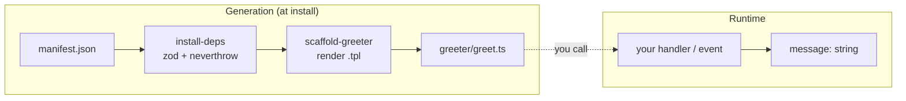

# Greeter — greeting service

The `greeter` module of the `@acme/pack-hello-service` pack **generates code** — a
`greet` helper — that you call wherever a greeting needs to be built. It is the
pack's default module.

> [!IMPORTANT]
> This module has **no HTTP routes of its own**. Installing the pack **creates the
> files, but produces no greeting on its own**. The result only appears when
> `greet(...)` is actually called. See
> [Integration and dead code](#4-integration--where-to-call-and-the-dead-code-warning).

---

## 1. What it does and real capabilities

The scaffold materializes three files under `<yourModule>/greeter/`:

| File | Role |
|------|------|
| `greet.ts` | `greet` helper + Zod schema + error union. |
| `index.ts` | Barrel re-exporting everything. |
| `README.md` | Short reference generated alongside the code. |

Real capabilities (read from the template, not invented):

- **`greet(input)`** — returns `Result<{ message: string }, GreetError>`
  (`neverthrow`; the happy path **never throws**).
- **Zod validation** — `greetInputSchema` = `{ name: string(1..120) }`. Invalid
  input becomes `err({ kind: 'invalid_input', issues })`, not an exception.
- **Configurable text** — the greeting uses the `greeting-text` prop (default
  `Hello`), baked into the generated code at install time.
- **Optional signature** — if `HELLO_{MODULE}_SIGNATURE` is set, it is appended on
  a new line after the greeting.

> [!NOTE]
> `{MODULE}` is replaced by your module name **in uppercase** at install time
> (e.g. module `checkout` → `HELLO_CHECKOUT_SIGNATURE`).

---

## 2. How it works (generator → generated code → runtime)



The generator renders the `.tpl` files substituting `{{module}}`, `{{MODULE}}` and
`{{greeting_text}}`, then writes the files into the target module. After that,
nothing runs until a call-site calls `greet`.

---

## 3. Usage examples

### In an Express controller

```ts
import { greet } from '@/modules/checkout/config/greeter/index.js';

export function helloController(req, res) {
  const r = greet({ name: req.params.name });
  if (r.isErr()) return res.status(400).json({ error: r.error.kind });
  return res.json({ message: r.value.message });
}
```

### In a post-signup event

```ts
import { greet } from '@/modules/checkout/config/greeter/index.js';

export function onUserCreated(user: { name: string }): void {
  const r = greet({ name: user.name });
  if (r.isOk()) logger.info({ msg: r.value.message });
}
```

---

## 4. Integration — where to call, and the dead-code warning

> [!WARNING]
> **Dead code is the number-one risk of this pack.** Install + generate creates
> `greet.ts`, but **nothing calls it automatically** — this pack has no route of
> its own and is not auto-wired by any NEP step. You **must** call `greet` at the
> desired spot, otherwise the pack stays inert.

<details>
<summary>How to wire it manually (e.g. in a route)</summary>

```ts
// src/modules/checkout/public/hello/index/use-cases/controller.ts (example)
import { greet } from '@/modules/checkout/config/greeter/index.js';

export function handler(req, res) {
  const r = greet({ name: String(req.query.name ?? 'world') });
  if (r.isErr()) return res.status(400).json({ error: r.error.kind });
  return res.json({ message: r.value.message });
}
```

Register the route in your routing. Without this call, `greet` stays dead code.
</details>

> [!TIP]
> This pack's **"Hello Service" agent** detects whether `greet` is already
> consumed (`describe_project`/`grep`) and, if not, **wires the call** at the
> call-site you indicate via `edit_file` — so no dead code is left.

---

## 5. Troubleshooting

| Situation | `GreetError.kind` | What to check |
|-----------|-------------------|---------------|
| Input rejected | `invalid_input` (issues) | `name` must be 1..120 chars. |
| `greet` "does nothing" | — | Confirm there is a real call (it is not auto-wired). |
| Greeting has no signature | — | Is `HELLO_{MODULE}_SIGNATURE` set in `.env`? |
| Wrong text in greeting | — | The `greeting-text` prop is baked at install; regenerate to change it. |
