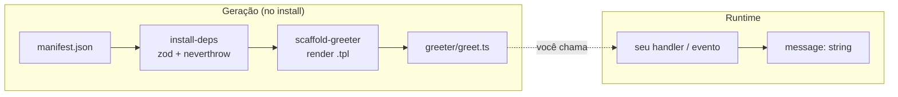

# Greeter — serviço de saudação

O módulo `greeter` do pack `@acme/pack-hello-service` **gera código** — um helper
`greet` — que você chama no ponto onde uma saudação precisa ser montada. É o
módulo default do pack.

> [!IMPORTANT]
> Este módulo **não tem rotas HTTP próprias**. Instalar o pack **cria os
> arquivos, mas não produz nenhuma saudação por conta própria**. O resultado só
> aparece quando `greet(...)` é efetivamente chamado. Veja
> [Integração e código morto](#4-integração--onde-chamar-e-o-alerta-de-código-morto).

---

## 1. O que faz e capacidades reais

O scaffold materializa três arquivos em `<seuModulo>/greeter/`:

| Arquivo | Papel |
|---------|-------|
| `greet.ts` | Helper `greet` + schema Zod + união de erros. |
| `index.ts` | Barrel que reexporta tudo. |
| `README.md` | Referência curta gerada junto ao código. |

Capacidades reais (lidas do template, não inventadas):

- **`greet(input)`** — retorna `Result<{ message: string }, GreetError>` (padrão
  `neverthrow`; o caminho feliz **nunca lança**).
- **Validação Zod** — `greetInputSchema` = `{ name: string(1..120) }`. Entrada
  inválida vira `err({ kind: 'invalid_input', issues })`, não uma exceção.
- **Texto configurável** — a saudação usa a prop `greeting-text` (default
  `Hello`), fixada no código gerado em tempo de instalação.
- **Assinatura opcional** — se `HELLO_{MODULE}_SIGNATURE` estiver setada, ela é
  anexada em uma nova linha após a saudação.

> [!NOTE]
> `{MODULE}` é substituído pelo nome do seu módulo **em maiúsculas** na instalação
> (ex.: módulo `checkout` → `HELLO_CHECKOUT_SIGNATURE`).

---

## 2. Como funciona (generator → código gerado → runtime)



O generator renderiza os `.tpl` substituindo `{{module}}`, `{{MODULE}}` e
`{{greeting_text}}`, e escreve os arquivos no módulo alvo. Depois disso, nada roda
até um call-site chamar `greet`.

---

## 3. Exemplos de uso

### Em um controller Express

```ts
import { greet } from '@/modules/checkout/config/greeter/index.js';

export function helloController(req, res) {
  const r = greet({ name: req.params.name });
  if (r.isErr()) return res.status(400).json({ error: r.error.kind });
  return res.json({ message: r.value.message });
}
```

### Em um evento pós-cadastro

```ts
import { greet } from '@/modules/checkout/config/greeter/index.js';

export function onUserCreated(user: { name: string }): void {
  const r = greet({ name: user.name });
  if (r.isOk()) logger.info({ msg: r.value.message });
}
```

---

## 4. Integração — onde chamar, e o alerta de código morto

> [!WARNING]
> **Código morto é o risco número 1 deste pack.** Instalar + gerar cria
> `greet.ts`, mas **nada o chama automaticamente** — este pack não tem rota
> própria nem é auto-fiado por nenhum step do NEP. Você **precisa** chamar `greet`
> no ponto desejado, senão o pack fica inerte.

<details>
<summary>Como fiar manualmente (ex.: numa rota)</summary>

```ts
// src/modules/checkout/public/hello/index/use-cases/controller.ts (exemplo)
import { greet } from '@/modules/checkout/config/greeter/index.js';

export function handler(req, res) {
  const r = greet({ name: String(req.query.name ?? 'mundo') });
  if (r.isErr()) return res.status(400).json({ error: r.error.kind });
  return res.json({ message: r.value.message });
}
```

Registre a rota no seu roteamento. Sem essa chamada, `greet` permanece código
morto.
</details>

> [!TIP]
> O **agente "Hello Service"** deste pack detecta se `greet` já está sendo
> consumido (`describe_project`/`grep`) e, se não estiver, **fia a chamada** no
> call-site que você indicar via `edit_file` — para não deixar código morto.

---

## 5. Troubleshooting

| Situação | `GreetError.kind` | O que verificar |
|----------|-------------------|-----------------|
| Entrada rejeitada | `invalid_input` (issues) | `name` deve ter 1..120 chars. |
| `greet` "não faz nada" | — | Confirme que há uma chamada real (não é auto-fiado). |
| Saudação sem assinatura | — | `HELLO_{MODULE}_SIGNATURE` está setada no `.env`? |
| Texto errado na saudação | — | A prop `greeting-text` é fixada no install; regenere para trocar. |
